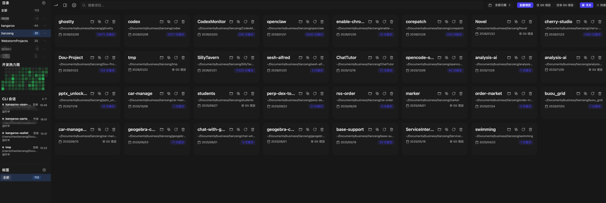
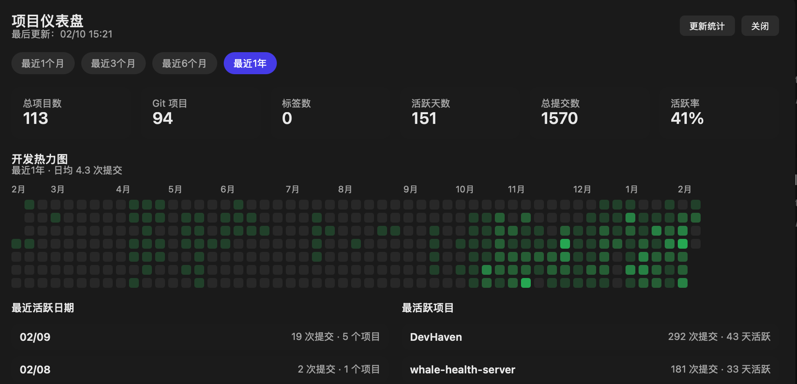
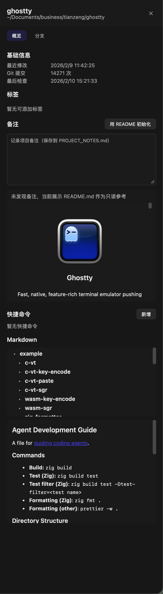
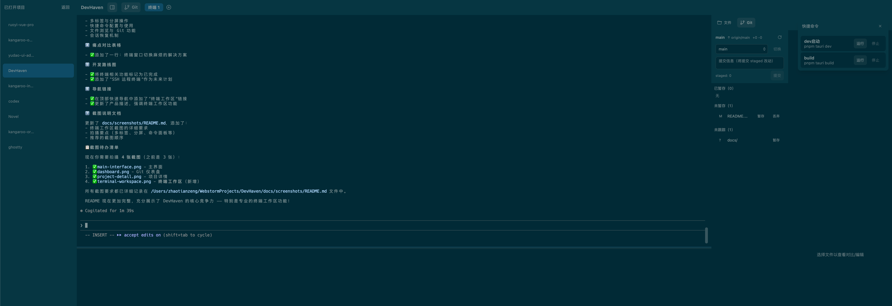

<div align="center">

# DevHaven

### 🚀 专业的多项目管理桌面工具

[](https://github.com/zxcvbnmzsedr/DevHaven)
[](./LICENSE)
[](https://tauri.app/)
[](https://react.dev/)

DevHaven 是一款专为开发者设计的桌面应用，帮助你高效管理多个项目，可视化 Git 活跃度，一键访问项目资源，集成专业终端工作区。

[功能特性](#-功能特性) • [终端工作区](#-专业终端工作区) • [快速开始](#-快速开始) • [使用指南](#-使用指南) • [技术栈](#-技术栈)

</div>

---

## 📸 产品预览

**主界面 - 项目管理**



**Git 活跃度仪表盘**



> 显示 Git 提交热力图和统计数据

**项目详情面板**



> 查看分支列表、编辑项目备注、快捷操作

**终端工作区**



> 内置终端工作区，支持多标签、分屏、快捷命令

---

## ✨ 功能特性

### 🗂️ 智能项目管理
- **批量扫描**：自动扫描工作目录及子目录，快速构建项目清单
- **灵活导入**：支持拖拽导入单个项目或整个目录
- **多维筛选**：通过标签、目录、关键字、时间范围、Git 状态快速定位项目

### 📊 Git 可视化分析
- **提交热力图**：直观展示每日代码活跃度
- **统计仪表盘**：项目提交次数、活跃度评估、时间分布
- **分支管理**：查看所有分支状态，一键切换

### 🏷️ 灵活标签系统
- **自定义标签**：为项目添加彩色标签，自由分类
- **标签隐藏**：临时隐藏不常用标签，保持界面整洁
- **批量操作**：支持批量添加或移除标签

### 📝 项目备注与文档
- **Markdown 编辑**：使用 Monaco Editor 编辑项目备注
- **自动保存**：备注自动保存到 `PROJECT_NOTES.md`
- **快速预览**：Markdown 渲染预览，支持代码高亮

### ⚡ 快捷操作
- **一键打开**：快速在文件管理器或 IDE 中打开项目
- **路径复制**：一键复制项目路径到剪贴板
- **终端集成**：直接在应用内打开项目终端

### 💻 专业终端工作区
- **多项目支持**：同时打开多个项目，每个项目独立的终端环境
- **标签与分屏**：支持多标签页和灵活的分屏布局（水平/垂直）
- **会话持久化**：终端会话自动保存，重启应用后恢复之前的工作状态
- **快捷命令面板**：配置项目常用命令，一键运行（如 `npm start`、`npm test`）
- **文件浏览器**：内置文件管理器，快速浏览项目文件结构
- **Git 集成**：右侧边栏显示 Git 状态，支持 Git Worktree 创建和管理
- **主题定制**：多款终端主题可选（Tokyo Night、Dracula、Monokai 等）
- **WebGL 加速**：可选的 WebGL 渲染，提升大量输出场景的性能
- **Shell 集成**：自动检测系统默认 Shell（bash/zsh/fish），完整的 PTY 支持

---

## 💡 为什么选择 DevHaven？

| 痛点 | DevHaven 的解决方案 |
|------|-------------------|
| 🤯 项目太多记不住 | 统一管理面板，标签分类一目了然 |
| 🔍 切换项目效率低 | 快速搜索 + 筛选，秒级定位目标项目 |
| 📉 不清楚项目活跃度 | Git 热力图可视化，活跃度评估一眼看清 |
| 🔁 频繁打开文件夹 | 一键操作：打开目录、复制路径、启动终端 |
| 📝 项目备注难管理 | 内置 Markdown 编辑器，备注随项目走 |
| 🖥️ 终端窗口切换麻烦 | 内置终端工作区，多项目多标签集中管理 |

---

## 🚀 快速开始

### 系统要求

- **Node.js**：>= 22.12.0（推荐使用 LTS 版本）
- **Rust**：Stable 版本 + 系统构建工具
- **Git**：用于读取提交统计和分支信息
- **操作系统**：macOS（推荐）/ Windows / Linux

### 安装与运行

```bash
# 克隆项目
git clone https://github.com/zxcvbnmzsedr/DevHaven.git
cd DevHaven

# 安装依赖
pnpm install

# 开发模式运行
pnpm run tauri dev

# 构建生产版本
pnpm run tauri build
```

### macOS 特别说明

如果遇到"无法打开应用"的安全提示，可以移除隔离属性：

```bash
sudo xattr -r -d com.apple.quarantine "/Applications/DevHaven.app"
```

> 请替换为实际应用的安装路径

---

## 📖 使用指南

### 1️⃣ 添加项目

**方式一：扫描目录**
1. 点击左侧边栏的「目录」按钮
2. 选择工作目录（DevHaven 会自动扫描子目录中的所有项目）
3. 等待扫描完成

**方式二：拖拽导入**
- 直接将项目文件夹拖拽到应用窗口即可

### 2️⃣ 管理标签

1. 点击「标签」按钮打开标签管理面板
2. 创建新标签，选择颜色
3. 为项目添加标签（支持多标签）
4. 使用标签快速筛选项目

### 3️⃣ 查看项目详情

1. 点击项目卡片进入详情面板
2. 查看分支列表、切换分支
3. 编辑项目备注（支持 Markdown）
4. 使用快捷操作：打开目录、复制路径、启动终端

### 4️⃣ 分析 Git 活跃度

1. 打开「仪表盘」标签
2. 查看提交热力图（按日期展示）
3. 查看统计数据：总提交数、活跃天数、平均提交频率
4. 筛选时间范围查看历史数据

### 5️⃣ 使用终端工作区

**打开终端工作区**
1. 在项目卡片上点击「终端」按钮
2. 系统打开独立的终端工作区窗口
3. 自动进入项目目录，准备就绪

**多标签与分屏**
- 点击 `+` 新建标签页
- 使用分屏按钮将终端水平/垂直分割
- 拖拽调整各分屏的大小比例
- 支持最多 4 个分屏同时工作

**快捷命令**
1. 点击右上角的快捷命令按钮（闪电图标）
2. 在面板中配置常用命令（如 `npm run dev`）
3. 点击命令旁的运行按钮，系统自动创建新标签并执行
4. 运行中的命令显示"停止"按钮，可一键终止

**文件浏览与 Git**
- 点击右侧边栏的「文件」标签，浏览项目文件
- 切换到「Git」标签，查看分支和工作区状态
- 支持创建 Git Worktree，方便并行开发

**会话恢复**
- 关闭终端工作区时，会话状态自动保存
- 重新打开项目时，恢复之前的标签、分屏和命令历史

---

## 🛠️ 技术栈

<table>
  <tr>
    <td align="center"><b>前端框架</b></td>
    <td>React 19.1 + TypeScript</td>
  </tr>
  <tr>
    <td align="center"><b>桌面框架</b></td>
    <td>Tauri 2.0</td>
  </tr>
  <tr>
    <td align="center"><b>构建工具</b></td>
    <td>Vite 7.0</td>
  </tr>
  <tr>
    <td align="center"><b>样式方案</b></td>
    <td>UnoCSS</td>
  </tr>
  <tr>
    <td align="center"><b>编辑器</b></td>
    <td>Monaco Editor（VS Code 内核）</td>
  </tr>
  <tr>
    <td align="center"><b>终端</b></td>
    <td>Xterm.js</td>
  </tr>
  <tr>
    <td align="center"><b>后端语言</b></td>
    <td>Rust</td>
  </tr>
</table>

---

## 🤝 参与贡献

欢迎提交 Issue 和 Pull Request！

1. Fork 本项目
2. 创建特性分支 (`git checkout -b feature/AmazingFeature`)
3. 提交更改 (`git commit -m 'Add some AmazingFeature'`)
4. 推送到分支 (`git push origin feature/AmazingFeature`)
5. 开启 Pull Request

---

## 📚 相关资源

- [Tauri 官方文档](https://tauri.app/)
- [React 官方文档](https://react.dev/)
- [Vite 官方文档](https://vite.dev/)
- [Git 官方文档](https://git-scm.com/docs)

---

## 📄 许可证

本项目采用 [GPL-3.0](./LICENSE) 协议开源。

---

<div align="center">

**⭐ 如果这个项目对你有帮助，请给个 Star 支持一下！**

Made with ❤️ by [zxcvbnmzsedr](https://github.com/zxcvbnmzsedr)

</div>
