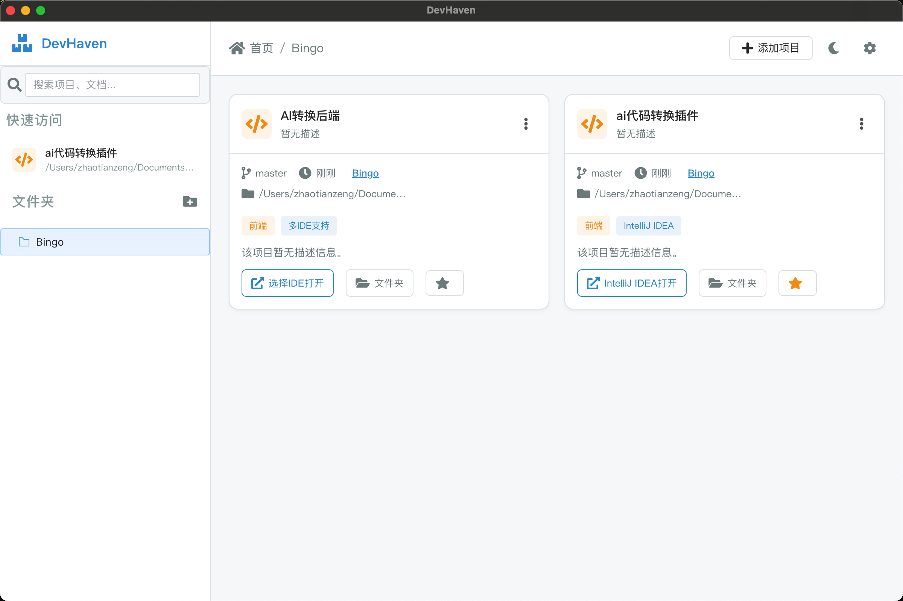
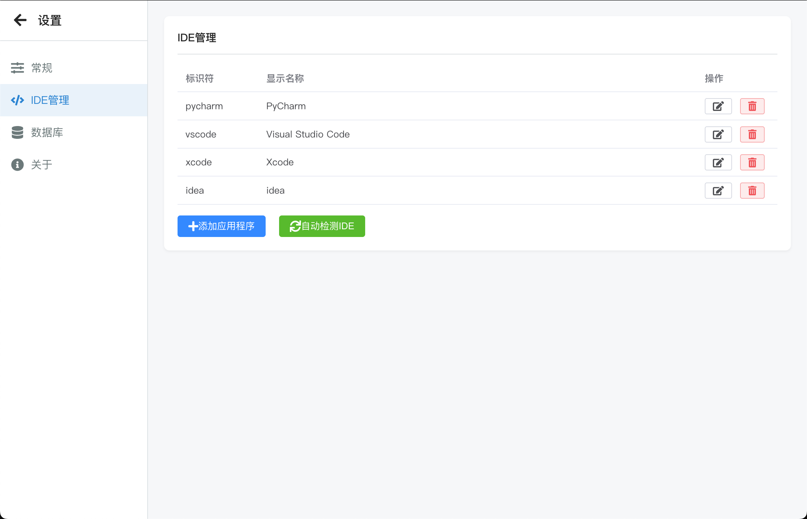
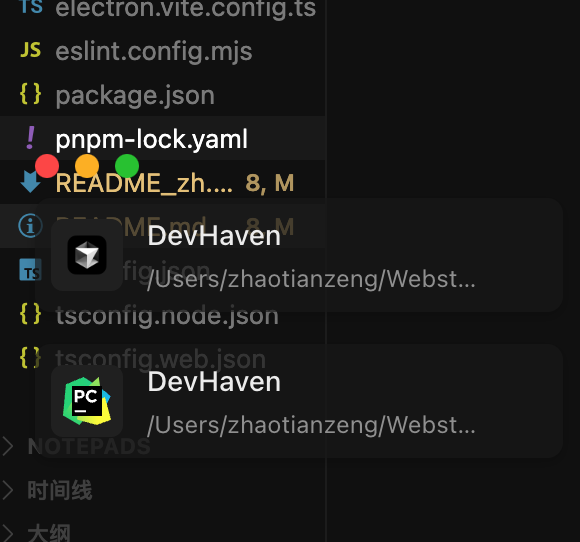
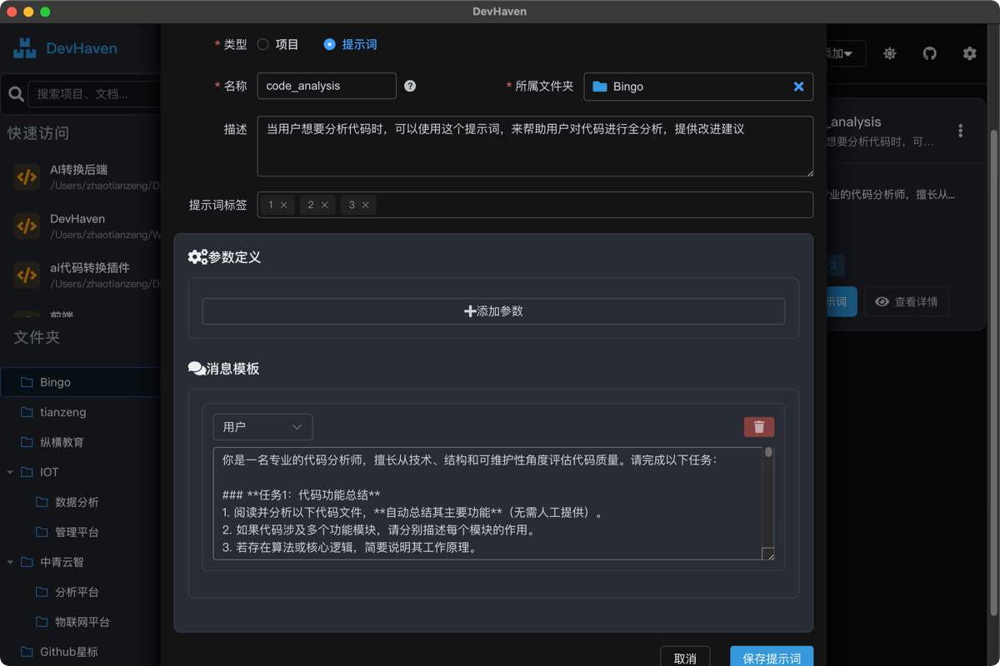
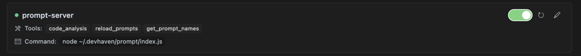
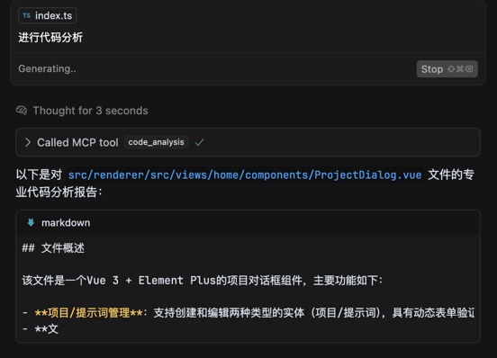

# DevHaven - Project Management Tool

[中文版](./README_zh.md)

A desktop application designed specifically for developers to help you organize and manage project folders scattered in various locations, offering a convenient one-click experience to open projects with your preferred IDE.

## Pain Points & Solutions

### Pain Points
- Developers often have code repositories from multiple companies and projects scattered across different folders
- Finding specific projects requires remembering or searching for paths, which is time-consuming
- Different projects may need to be opened with different IDEs
- Project-related information (such as branches, documentation, etc.) lacks centralized management

### Solutions
DevHaven provides a centralized platform that integrates all projects into a single interface, making it easy to find and access them, and supports opening projects with the corresponding IDE with just one click, greatly improving development efficiency.

## Core Features

- **Project Organization**: Organize projects by company/folder hierarchy
- **Quick Access**: Open projects with preferred IDEs (VS Code, IntelliJ IDEA, WebStorm, etc.) in one click
- **Project Details**: View project path, Git branch, last opened time, and other information
- **Tag Classification**: Add tags and categories to projects
- **Custom Database Location**: Easy to backup and synchronize
- **Dark/Light Theme**: Switch interface themes
- **Search Function**: Quickly find projects
- **Cross-IDE File Switching**: Quickly switch between different IDEs for the same file through a floating window, allowing you to edit the same file in different IDEs without manual navigation
- **Prompt Management**: Manage prompts and provide MCP access for AI tools like Cursor, inspired by: https://github.com/gdli6177/mcp-prompt-server

## MCP Configuration
When starting the application, prompts will be mounted to the local directory, and the MCP environment will be set up in the %HOME%/.devhaven/prompt directory.

If MCP is not loaded, you may need to run `npm install` in this directory to install dependencies.

```json
{
  "prompt-server": {
    "command": "node",
    "args": [
      "~/.devhaven/prompt/index.js"
    ],
    "transport": "stdio"
  }
}
```

## Plugin Support
To provide a smoother development experience, DevHaven offers companion IDE plugins that automatically synchronize projects opened in IDEs to the DevHaven application:
- [**VS Code Plugin**](https://github.com/zxcvbnmzsedr/devhaven-vs-plugin) - Automatically synchronize projects opened in VS Code
- [**IntelliJ IDEA Plugin**](https://github.com/zxcvbnmzsedr/devhaven-idea-plugin) - For all IDEs on the IntelliJ platform (including WebStorm, PyCharm, etc.)

These plugins can:
- Automatically detect projects opened in the IDE
- Synchronize project information to DevHaven
- Eliminate the need to manually add projects, improving work efficiency

For more information, please check the [plugin directory](./plugin).

## Tech Stack

- **Frontend**: Vue.js 3 (Composition API), Element Plus
- **Styling**: UnoCSS
- **State Management**: Pinia
- **Database**: SQLite with better-sqlite3
- **Desktop Integration**: Electron

## Development Guide

### Requirements

- Node.js 14+
- pnpm (recommended) or npm

### Installation & Launch

1. Clone the repository
2. Install dependencies:

```bash
pnpm install
```

3. Start the development server:

```bash
pnpm dev
```

### Building the Application

Build for current platform:

```bash
pnpm build
```

Build for specific platforms:

```bash
# Windows
pnpm build:win

# macOS
pnpm build:mac

# Linux
pnpm build:linux
```

# Preview
## Project Management



## Prompt Management



